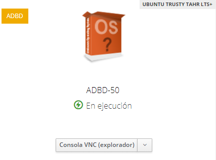
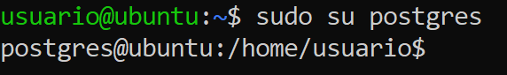
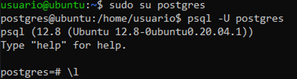
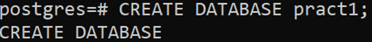
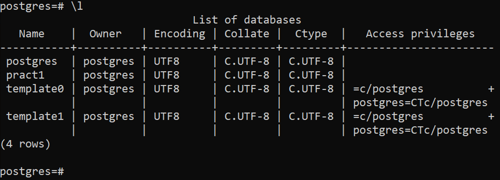
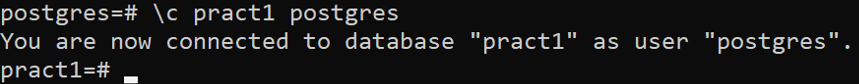
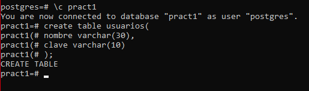
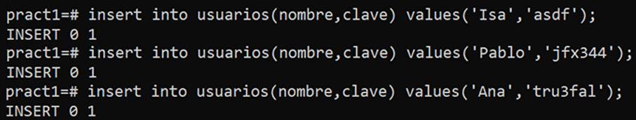
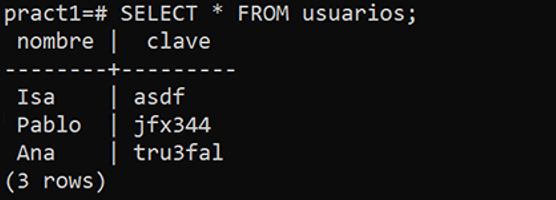

## 1. Introducción
En esta práctica instalaremos el sistema de gestión de bases de datos **PostgreSQL**, y crearemos una base de datos de prueba. Se trabajará en una máquina virtual soportada por el IaaS, en nuestro esta se denomina **ADBD-50**.

## 2. Instalación y acceso
En primer lugar instalaremos PostgreSQL en la máquina virtual, para ello accedemos a la máquina a través del IaaS o SSH e introducimos lo siguiente:

	
Una vez realizado esto, accedemos como superusuario, para ello realizamos:

Después de entrar a PostgreSQL, nos  identificaremos como usuario _postgres_ mediante el comando:  `psql -U postgres`

Con este paso, ya estaríamos listos para trabajar con el sistema de gestión de bases de datos **PostgreSQL**.

## 3. Ejemplo práctico

A continuación procederemos a crear una base de datos siguiendo el ejemplo planteado en la explicación de la tarea a realizar.

### 3.1 Crear base de datos

Lo primero que debemos hacer es crear una base de datos, en este caso la denominaremos **pract1**, para ello introducimos lo siguiente:

Verificaremos que se haya creado la base de datos mediante el comando: `\l`. Esto nos lista las bases de datos.

### 3.2 Crear tabla

Ahora procedemos a crear una tabla para la base de datos de _prac1_, esta recibirá el nombre de **usuarios**, para crearla primero debemos de conectarnos a la base datos prac1 de la siguiente manera:

Una vez conectados a _pract1_, ahora si podemos crear la tabla como a continuación:

Se puede apreciar que tanto **nombre** como **clave**, almacenarán datos de tipo varchar, esto indica que los datos a almacenar serán caracteres de longitud variable con límite de _30 caracteres para nombre_, y _10 para clave_.

### 3.3 Introducir datos en una tabla

A continuación, para introducir datos en una tabla, debemos de realizarlo de la siguiente manera:

Se puede apreciar como hemos introducido en la tabla _usuarios_, 3 valores de nombre y clave, para comprobar que hayamos realizado correctamente estas operaciones, realizamos una consulta:

Finalmente, salimos de la base de datos pract1 mediante el comando `\q`, a su vez, para salir del entorno de postgreSQL, ejecutamos el comando exit. Con esto ya habríamos concluido correctamente con el ejercicio práctico planteado. 

